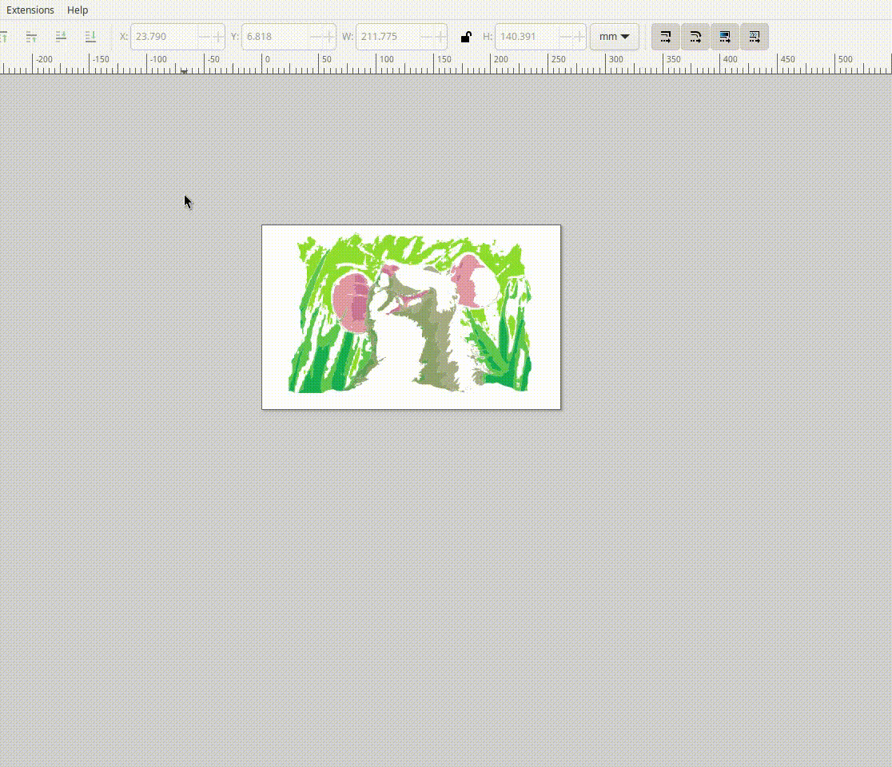

# inkscape-posterbator

An Inkscape extension which slices objects, scales to paper size and makes a poster.
Heavily inspired by this great idea: https://rasterbator.net/#

Posterbator main goal is to help in creating huge stencils, which consist of many A4 (or any other regular sizes) sheets.

Since stencils are about cutting, the holes on the image are the huge problem: when you cut the main
shape from a stencil sheet, a hole on a shape itself should remain (remember we deal with stencils, so shape is cut, hole should remain), but this is impossible.

So in order to make holes persist on a stencil we should make a separate group with holes, which can be painted on top of the main image.

How do we find holes?

1. "split" every element, which creates many separated elements (paths) for compound objects, so each newly created element will have only one shape (but shape with a hole will still contain a hole).
1. Store all elements after "split" operation into a list.
1. "break apart" every element, which splits further and separates holes from objects.
1. Find the difference between stored list after "split" and current list of elements, the difference list is the list with holes.

## In action

